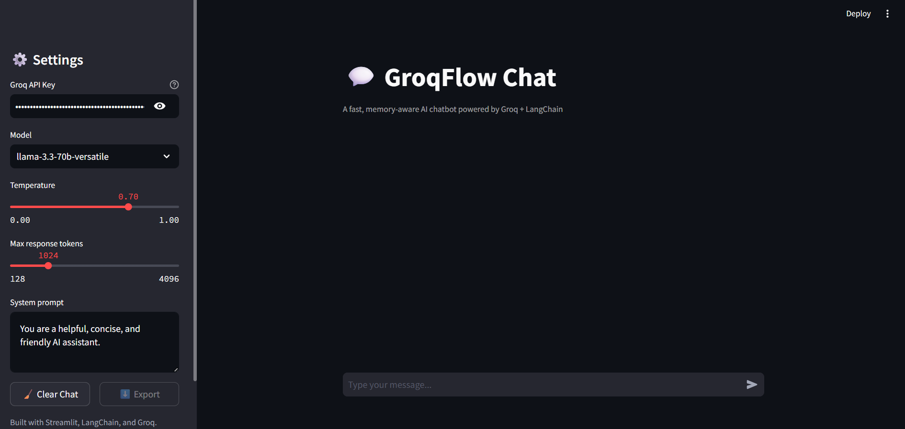
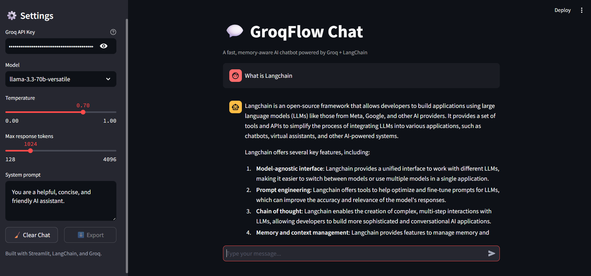

# GroqFlow Chat


A production-structured Streamlit chat application powered by Groq's LPU inference and orchestrated with LangChain. It provides per-session conversational memory, streaming responses, and a configurable sidebar, and is packaged for containerized deployment.

## Features

- **Streaming responses** - assistant replies are rendered token-by-token in a typing-style UI.
- **Per-session memory** — each browser tab gets an isolated conversation history via LangChain's `RunnableWithMessageHistory`, capped at the most recent 20 messages so context (and token spend) doesn't grow unbounded.
- **Configurable sidebar** — switch between models (`llama-3.3-70b-versatile`, `llama-3.1-8b-instant`, `gemma2-9b-it`), adjust temperature and max response tokens, and edit the system prompt at runtime.
- **Resilient API calls** — transient Groq failures are retried automatically (exponential backoff, up to 2 retries) and mapped to friendly, user-facing error messages instead of raw stack traces.
- **Chat export** — download the current conversation as a timestamped JSON file.
- **Clear chat** — reset both the displayed transcript and the underlying LangChain session memory.
- **Optional LangSmith tracing** — set the standard `LANGCHAIN_*` environment variables to get run-by-run visibility into every prompt and chain step.
- **Tested** — unit tests cover session history isolation/trimming and settings validation.
- **Containerized** — includes a Dockerfile for a self-contained deployment.

## Screenshots

| Preview | Results |
|---|---|
|  |  |

## Tech Stack

| Layer | Technology |
|---|---|
| UI | Streamlit |
| Orchestration | LangChain (`RunnableWithMessageHistory`) |
| Inference | Groq (`langchain-groq`) |
| Retry logic | Tenacity |
| Testing | Pytest |
| Linting | Ruff |
| Deployment | Docker |

## Project Structure

```
.
├── app.py                  # Streamlit entrypoint: UI, sidebar, chat loop
├── src/
│   ├── chatbot.py           # LangChain chain construction, streaming, retries
│   ├── config.py             # AppSettings, environment/env-var handling, validation
│   └── logging_utils.py      # Shared logger factory
├── tests/
│   ├── test_chatbot.py       # Session history and error-message tests
│   └── test_config.py        # AppSettings validation tests
├── Dockerfile
├── requirements.txt
└── requirements-dev.txt
```

## Getting Started

### Prerequisites

- Python 3.11+
- A free Groq API key from [console.groq.com](https://console.groq.com)

### Installation

```bash
git clone https://github.com/Chowdri-Furkhan07/groqflow-chat.git
cd groqflow-chat
pip install -r requirements.txt
```

### Configuration

Set your API key as an environment variable (or a `.env` file, which is loaded automatically):

```bash
GROQ_API_KEY=your-groq-api-key
```

The key can also be entered directly in the sidebar at runtime, which overrides the environment value.

Optional — enable LangSmith tracing:

```bash
LANGCHAIN_TRACING_V2=true
LANGCHAIN_API_KEY=ls__...
LANGCHAIN_PROJECT=langchain-groq-chatbot
```

### Run

```bash
streamlit run app.py
```

The app will be available at `http://localhost:8501`.

### Run with Docker

```bash
docker build -t groqflow-chat .
docker run -p 8501:8501 -e GROQ_API_KEY=your-groq-api-key groqflow-chat
```

## Testing

```bash
pip install -r requirements-dev.txt
pytest
```

## License

Distributed under the MIT License. See `LICENSE` for details.

## Author

**Chowdri Furkhan**
GitHub: [@Chowdri-Furkhan07](https://github.com/Chowdri-Furkhan07)
